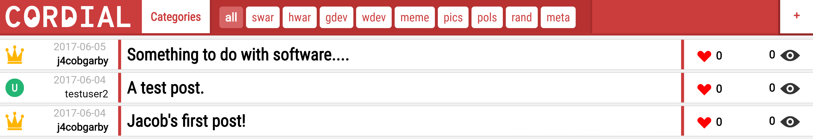

**Note that bold fonts in Cordial look quite significantly better on browsers which aren't called Firefox, since it uses fonts directly from Google fonts, and when Firefox renders these in bold, it doesn't look so good. It's bareable, but I would suggest using Opera or Chrome**

# How to use

## Locally (for development)

 1. Download and install XAMPP from [here](https://www.apachefriends.org/index.html). Make sure to install the Apache webserver *and* the MySQL server. You may install any of the other modules XAMPP offers, but you don't need them for this. If you already have XAMPP installed but don't have the required modules installed, you can always install them from the XAMPP Control Panel.
 
 2. Navigate to 'htdocs' the directory in which XAMPP is installed. On Windows, this is by default 'C:\xampp'. On MacOS, it seems that there is no *default* location, but I don't have a Mac to test it on.
 
 3. Clone the repository into 'htdocs'.
 
 4. Now, open up the XAMPP Control Panel, and press 'Start' next to both the Apache and MySQL modules.
 
 5. In the XAMPP Control Panel, press the button labelled 'Admin' for the MySQL module. Given that MySQL is running, this should open up phpMyAdmin in a web browser. There will probably be some default databases, ignore those.
 
 6. Click 'Import' (on the top navigation bar,) and either drag in 'cordial.sql' or click 'Browse' and navigate to it.
 
 7. Click on the '+' symbol next to the newly created database named 'cordial' on the left hand side of the browser, to open up the tables. You should see a table names 'posts' and a table named 'users'. They both have some records in them - some fake users and posts. Notice it's a relational database - one user to many posts. If you want, you can delete these records.
 
 8. Create a new tab in your web browser and go [here](http://localhost/Cordial/Source/Cordial/) (localhost/Cordial/Source/Cordial.)
 
 9. **Done!**
 
*You will need internet connection even though it's local, since Cordial gets some fonts from Google fonts.*

## Live version

 1. [Click on this text](http://cordial.jacobgarby.co.uk).
 
 2. That's it.
 
# How to contribute

 1. Fork Cordial.
 
 2. Create a branch for your new feature.
 
 3. Commit to it. Use the local development instructions above for testing, etc.
 
 4. ~Twist it~
 
 5. ~Bop it~
 
 6. Push it!
 
# Stuff that needs doing

 - Cleaning up the .less files a bit
 
 - Being able to write posts
 
# License

### GNU General Public License v3.0
